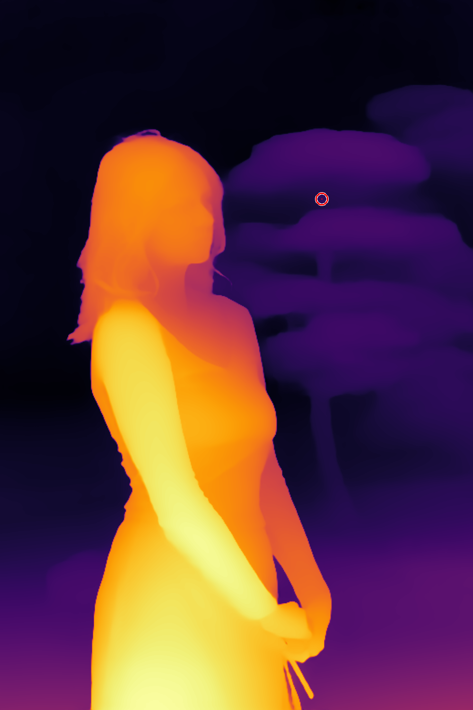
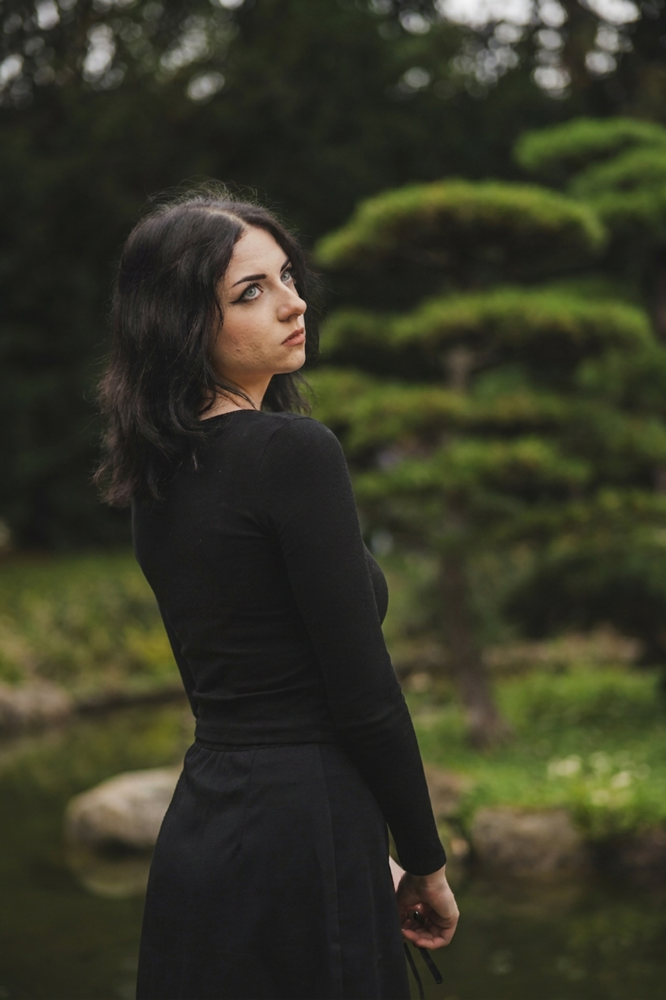
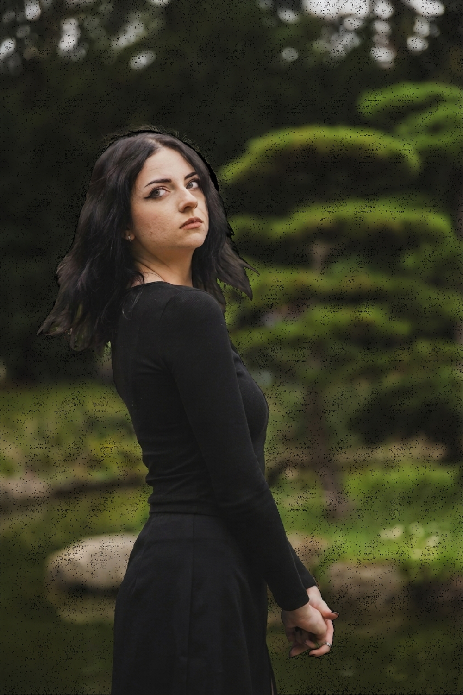
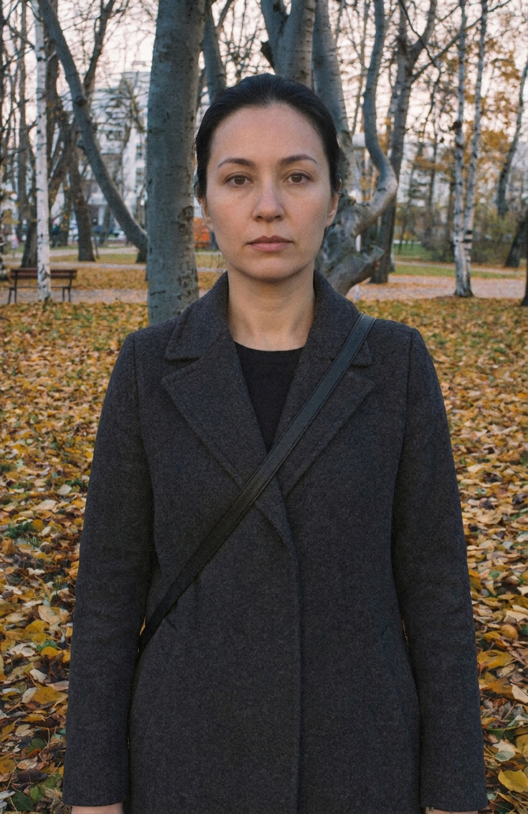

# GazeCtrl — Training-Free Gaze Redirection

Redirect where a person looks in a photo — **no model training, no fine-tuning**.
The pipeline segments the person, estimates a monocular depth map, and uses both
as a *3D-aware prompt* for Gemini's image-editing model, then composites the
edited person back into the original background.

This is "Path E" of a broader gaze-control research project — the approach that
worked well enough to become the main pipeline, after several earlier
warp/prompt-only approaches (Paths A–D) were tried and dropped.

## Example

| Before | After (redirected to look up and to the right) |
|---|---|
|  |  |

Generated with `manual_process_path_e.py`: SAM segments the person, a gaze
target is placed off to the side at a specific depth, and Gemini redirects
only her head/gaze — the background and clothing are left untouched, and the
gap left behind by the head turn is seamlessly repainted.

Photo: [Pexels](https://www.pexels.com/) (free-to-use license).

<details>
<summary>Intermediate pipeline outputs for this example</summary>

| Isolated person + gaze target (Image 1 sent to Gemini) | Depth map + target depth (Image 2 sent to Gemini) |
|---|---|
|  |  |

</details>

## Ablation: what each design choice actually buys you

The pipeline leans on four things: **person mask/isolation**, the **depth
value** attached to the gaze target, sending that target as a **visual
(image) marker** rather than a text description, and a **carefully worded
text prompt**. Each is tested below by changing only that one piece and
re-running the same photo, person, and (where applicable) the same 2D
target position.

### 1. The depth value is actually used — not decoration

Same photo, same red-dot **2D screen position**, only the *depth value*
assigned to that point changes (visualized as the ring's fill color on the
depth map — dark/purple = far, bright/yellow = near):

| Depth = far / "BEHIND the person" | Depth = near / "IN FRONT OF the person" | No depth image sent at all |
|---|---|---|
|  |  | *(single image, no depth reference)* |
|  |  |  |

Same 2D point, two completely different outcomes: told the target is *far
behind her*, she turns her whole torso around to look back over her
shoulder; told the exact same screen position is *close, in front of her*,
she only turns her head/eyes toward it and her body stays put. Remove the
depth image entirely and Gemini doesn't move her at all — a 2D point alone
doesn't tell it whether "behind" is even a possibility.

### 2. A visual marker beats describing the target in words

| No visual prompt (text-only: *"look up and to her right, as if noticing something behind her shoulder"*) | With visual prompt (red-dot marker, same designed prompt) |
|---|---|
|  |  |

The text-only version does turn her in roughly the right direction, but
it's imprecise — there's no way to specify *exactly* which pixel to look
at from words alone. It's also visibly noisier: without a marker to anchor
the edit, the resulting pose drifts further from the original SAM mask,
so the background-repair pass has a harder job and introduces grain/artifacts
that the marker-guided version doesn't have.

### 3. The designed text prompt keeps the edit contained

| Full method (mask + depth prompt + designed text) | Mask + depth prompt kept, but generic text |
|---|---|
|  |  |

Same two images, only the wording changes. The generic prompt ("look at
the red dot in image 2, which shows depth") still gets a head turn, but
loses control: a tree branch that doesn't exist in the source photo gets
hallucinated into the corner, and the red-dot marker isn't cleaned up
afterward. The designed prompt's explicit instructions (ignore current
gaze, keep the background pixels, don't move the marker) are doing real
work in keeping the edit contained to just the gaze.

> The leftover red-dot marker visible in a couple of the images above was a
> real bug at the time they were generated: Gemini doesn't always keep the
> marker exactly where it was told to, especially on large pose changes, so
> pasting its output back verbatim could leave a stray red dot in the final
> image. The pipeline now detects and blanks out marker-colored pixels by
> color (not fixed coordinates) before the repair pass, in both
> `manual_process_path_e.py` and `dataset_pipeline.py` (see
> `model_utils.remove_red_marker`), so this specific artifact no longer
> occurs regardless of which prompt/mask configuration is used.

### 4. Mask/isolation matters most with more than one person

*(pending — see below)*

## Beyond gaze: turning a person all the way around

The pipeline was designed for gaze redirection, but the same
mask + depth + prompt recipe generalizes further than expected: pointing
the target at (roughly) the camera's own position, with a prompt telling
Gemini the person currently has their back turned, gets a full 180°
turn-around — not just eyes, the whole head and body:

| Before (facing away) | After (turned to face the camera) |
|---|---|
|  |  |

Since her face isn't visible anywhere in the source photo, Gemini has to
**invent** one from scratch — consistent with her visible hair color, build,
and clothing, but not a real reconstruction of her actual face. That's a
meaningfully different claim than the gaze-redirection demos above (which
only ever reveal a face that's already partially visible in the source
image), and worth keeping in mind for any use case where the generated
face matters, not just the head pose.

Getting a clean result here also took an extra iteration: the first attempt
placed the target at the back of her head's original 2D position, which
made the newly generated face look *up* at it instead of at the camera —
a reminder that with a full pose change like this, the target position
needs to account for where the new face will actually end up, not just
where the old head was.

## How it works

```
                 ┌────────────┐        ┌──────────────────┐
  input image ──▶│    SAM     │───────▶│   person mask     │
                 │ (point     │        └──────────────────┘
                 │  prompt)   │
                 └────────────┘

                 ┌────────────────────┐
  input image ──▶│  Depth-Anything-V2 │───────▶ depth map
                 └────────────────────┘

  user clicks: (1) the person  (2) the gaze target + a depth slider
                                  │
                                  ▼
        ┌───────────────────────────────────────────────┐
        │ isolate_person_and_depth()                     │
        │  Image 1 — person cut out on black, solid       │
        │            red dot at the gaze target           │
        │  Image 2 — full depth map, hollow red ring       │
        │            colored at the target's chosen depth  │
        └───────────────────────────────────────────────┘
                                  │
                                  ▼           (dual-image prompt describing
                        Gemini image edit      whether the target is in front
                        (gemini-3-pro-image)    of / behind / level with the
                                  │             person, in depth terms)
                                  ▼
              person redirected to look at the red dot
                                  │
                                  ▼
        composite onto the original background (cv2.add over
        the punched-out region) → black gaps where the person
        used to stand / now stands
                                  │
                                  ▼
        gap repair: 2nd Gemini pass ("fill only the black areas")
        or OpenCV TELEA inpainting (--repair inpaint)
                                  │
                                  ▼
                            final image
```

The key idea is that a single 2D red dot is ambiguous about *depth* — Gemini
can't tell if you want the person looking at something close or far away.
Passing a **second image** (the depth map) with the target rendered in the
matching depth color, plus a text prompt stating the target is "in front
of" / "behind" / "at the same depth as" the person, resolves that ambiguity
and produces much more consistent head/eye redirection.

## Repository layout

| File | Purpose |
|---|---|
| [model_utils.py](model_utils.py) | Lazy loaders for SAM, Depth-Anything-V2, L2CS-Net, and the Gemini API key/model config. Shared by everything below. |
| [manual_process_path_e.py](manual_process_path_e.py) | **Interactive, single image.** Click through the whole pipeline and inspect every intermediate output. Start here. |
| [dataset_pipeline.py](dataset_pipeline.py) | **Batch, folder of images.** Same pipeline, run over many images with a resumable, numbered-step output per sample + a JSON manifest. |
| [estimate_gaze_batch.py](estimate_gaze_batch.py) | Runs a gaze-estimation model (L2CS-Net by default) on the pipeline's output and records the angular error against the originally-requested gaze target. |
| [build_training_set.py](build_training_set.py) | Filters `dataset_pipeline.py` output by angular error and packages it into a flat `manifest.csv` — meant to feed a downstream model (e.g. a distilled ControlNet), not part of the training-free pipeline itself. |

`sam_vit_h_4b8939.pth` (the SAM checkpoint) is auto-downloaded on first run and
is git-ignored — don't expect it to be in the repo.

## Setup

### 1. Directory layout

This repo depends on two external model repos that are **not** vendored here
(they're large, actively-maintained projects with their own weights). Clone
this repo, then clone the following as *sibling* directories:

```
some-folder/
├── training-free-path/        ← this repo
├── Depth-Anything-V2/         ← required
└── L2CS-Net/                  ← only required for estimate_gaze_batch.py
```

```bash
git clone https://github.com/VicsonPeng/GazeCtrl_train_free.git training-free-path
git clone https://github.com/DepthAnything/Depth-Anything-V2.git

# Only needed if you want to run the Phase 2 gaze-accuracy evaluation:
git clone https://github.com/Ahmednull/L2CS-Net.git
```

For L2CS-Net, also download `L2CSNet_gaze360.pkl` per [the L2CS-Net
README](https://github.com/Ahmednull/L2CS-Net) and place it at
`L2CS-Net/models/L2CSNet_gaze360.pkl`.

### 2. Python environment

```bash
cd training-free-path
pip install -r requirements.txt
```

### 3. Gemini API key

```bash
cp .env.example .env
# then edit .env and set GEMINI_API_KEY=...
```

### 4. Checkpoints

- **SAM (ViT-H, ~2.5 GB)** — auto-downloaded to `training-free-path/sam_vit_h_4b8939.pth`
  on first run.
- **Depth-Anything-V2 (ViT-S)** — auto-downloaded via `huggingface_hub` into
  `Depth-Anything-V2/checkpoints/` on first run.

Both downloads happen automatically the first time you run any script — no
manual step needed beyond having internet access and the sibling repo cloned.

## Usage

### 1. Single image (start here)

```bash
python manual_process_path_e.py --image path/to/photo.jpg
```

A window opens with three panels (original / depth / mask). Click once on the
person (SAM segments them), click again where they should look, adjust the
depth slider if needed, then confirm. You'll be asked before anything is sent
to Gemini. Results land in `e_results/<001, 002, ...>/`, including every
intermediate image and the exact prompt sent.

### 2. Batch over a folder of images

```bash
python dataset_pipeline.py --dataset path/to/images_folder
python dataset_pipeline.py --dataset path/to/images_folder --repair inpaint   # skip the 2nd Gemini call, use OpenCV inpainting instead
python dataset_pipeline.py --dataset path/to/images_folder --resume           # skip images already fully processed
python dataset_pipeline.py --dataset path/to/images_folder --files a.jpg b.jpg # only process specific files
python dataset_pipeline.py --dataset path/to/images_folder \
    --prompt-extra "Keep clothing and background unchanged."
```

Each image gets its own output folder (`e_results/<image_name>/`) containing
`01_depth.png` through `07_final.png`, `prompt.txt`, and `metadata.json`
(gaze target, chosen depth, computed 3D target-gaze vector, SAM mask coverage,
etc.). A top-level `manifest.json` aggregates every sample's metadata.

### 3. Evaluate how accurate the redirected gaze is

```bash
python estimate_gaze_batch.py --results-dir e_results --model l2cs
```

Runs a gaze-estimation model on each `07_final.png`, compares it against the
`target_gaze` computed during pipeline generation, and writes
`predicted_gaze` / `angular_error_deg` back into each `metadata.json`.
`--model` also supports `6drepnet` and `3dgazenet`, each of which needs its
own environment/weights (see the docstring at the top of the script).

### 4. Package a training-ready dataset

```bash
python build_training_set.py --results-dir e_results --output training_data --max-error 20
python build_training_set.py --results-dir e_results --dry-run   # just print stats, copy nothing
```

Keeps only samples under the angular-error threshold, copies the
isolated-person / final / background images into a flat structure, and writes
`manifest.csv` + `stats.json`.

## Notes & limitations

- The pipeline is interactive by design (tkinter click UI) — there is no
  automatic "just pick the biggest person" mode; you always confirm the
  person and the gaze target yourself.
- Gemini's image-editing API is the bottleneck: it's rate-limited and
  occasionally returns `503`s. Both Gemini calls (gaze edit, gap repair)
  retry with backoff.
- Gap-repair quality depends on whichever method you pick: a second Gemini
  call produces the most seamless backgrounds but costs another API call;
  `--repair inpaint` (OpenCV TELEA) is free and instant but visibly weaker
  on complex backgrounds.
- Depth is *relative*, not metric — "in front of / behind" is inferred by
  comparing the depth value at the clicked target against the median depth
  inside the person's mask, not an absolute distance.

## License

No license has been declared yet for this repository — treat the code as
research/reference material. Open an issue if you'd like to use it under a
specific license.
